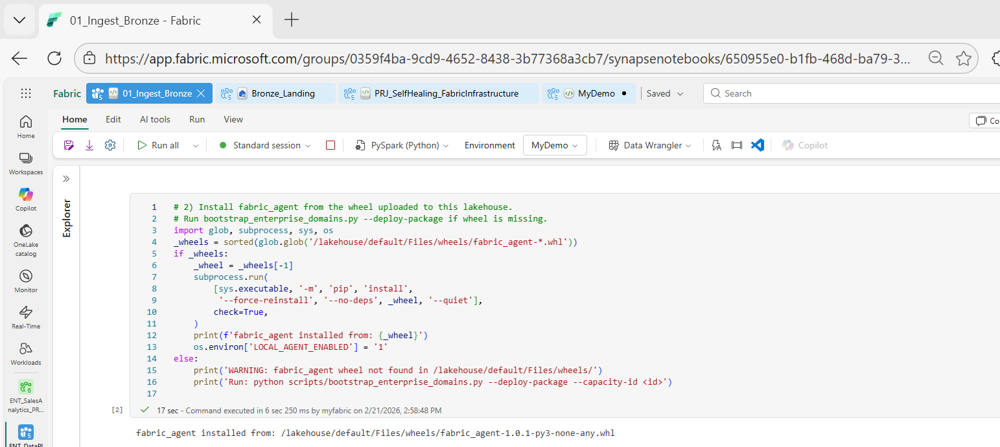
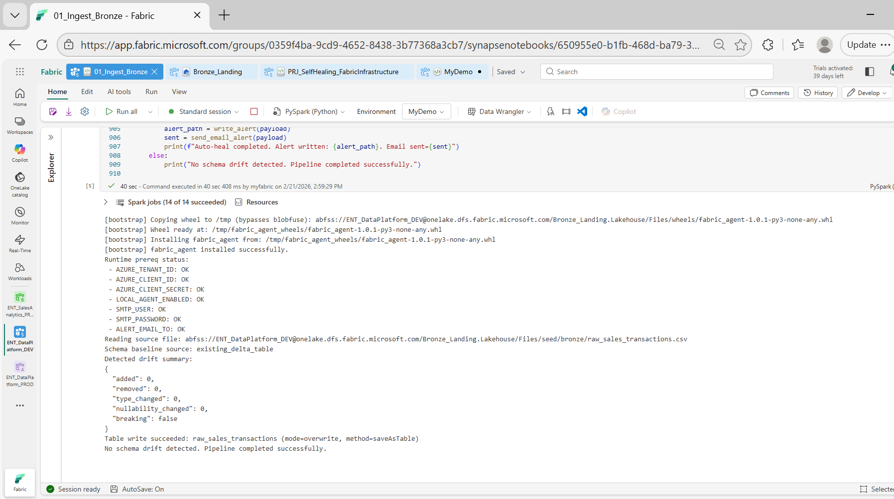
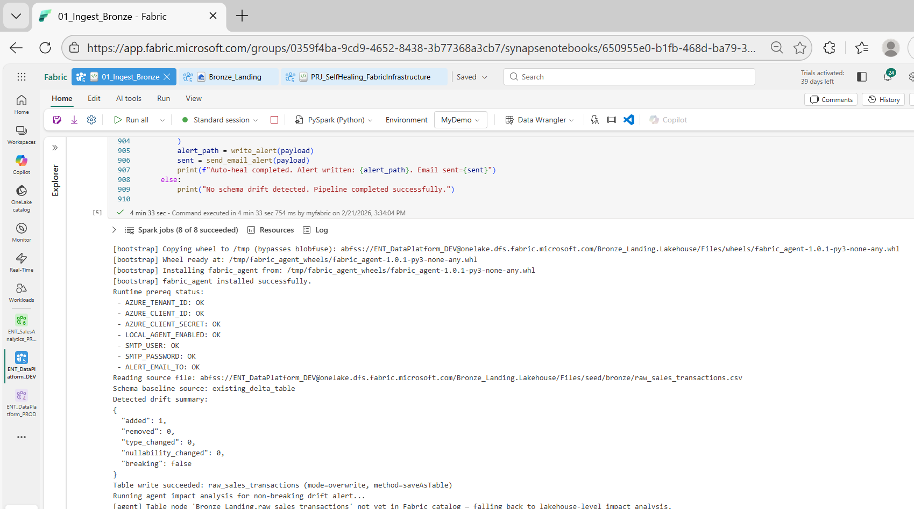
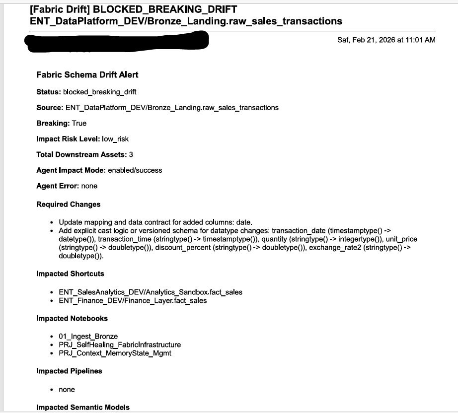

# 01_Ingest_Bronze Proof Document

This document captures the proof pack for:
`01_Ingest_Bronze` in workspace `ENT_DataPlatform_DEV`.

## Scope

This proof validates the ingestion guardrail workflow for vendor file schema drift:

1. Day-2 schema comparison against existing Delta baseline.
2. Drift classification (non-breaking vs breaking).
3. Non-breaking auto-heal write path.
4. Breaking drift alert path with optional block behavior.
5. Agent-assisted downstream impact analysis and notification payload.

Out of scope:

1. Cross-workspace continuous ops monitoring notebook (`PRJ_SelfHealing_FabricInfrastructure`).
2. Generic semantic-model refactor tools.

## Environment Under Test

1. Workspace: `ENT_DataPlatform_DEV`
2. Lakehouse: `Bronze_Landing`
3. Table: `raw_sales_transactions`
4. Notebook: `01_Ingest_Bronze`
5. Runtime: Fabric Notebook (PySpark)

## Validated Scenarios

### S1: No Drift (Control)

Observed result:

1. `added: 0`
2. `removed: 0`
3. `type_changed: 0`
4. `breaking: false`
5. `Table write succeeded`

### S2: Non-Breaking Drift (Auto-Heal)

Observed result:

1. `added: 1`
2. `type_changed: 0`
3. `breaking: false`
4. Table write succeeded
5. Non-breaking impact analysis path executed

### S3: Breaking Drift (Block/Alert Path)

Observed result:

1. `breaking: true` with type-change detection
2. Alert JSON written under `Files/alerts/schema_drift/`
3. Email alert sent
4. Required changes section populated
5. Agent impact analysis included in payload

### S4: Agent Impact Enrichment

Observed result:

1. `agent_impact_analysis.enabled: true`
2. `agent_impact_analysis.success: true`
3. Impact payload includes affected notebooks/assets and risk summary

## Captured Evidence (From Provided Runs)

The following concrete outputs were captured during validation in `ENT_DataPlatform_DEV`.

1. No-drift run (control):
   - `Schema baseline source: existing_delta_table`
   - Drift summary: `added=0, removed=0, type_changed=0, nullability_changed=0, breaking=false`
   - Output: `Table write succeeded: raw_sales_transactions (mode=overwrite, method=saveAsTable)`
   - Output: `No schema drift detected. Pipeline completed successfully.`

2. Non-breaking additive run (auto-heal):
   - Drift summary: `added=1, removed=0, type_changed=0, nullability_changed=0, breaking=false`
   - Output: `Table write succeeded: raw_sales_transactions (mode=overwrite, method=saveAsTable)`
   - Output: `Running agent impact analysis for non-breaking drift alert...`

3. Breaking run (alert path):
   - Alert payload `status`: `blocked_breaking_drift`
   - Drift details included added + type-changed columns with `breaking=true`
   - `required_changes` populated with contract/mapping + cast/version guidance
   - `agent_impact_analysis`: `enabled=true`, `success=true`
   - Alert JSON written under `Files/alerts/schema_drift/`
   - Email send line confirmed in notebook output

4. Runtime packaging stability fix (final notebook state):
   - Notebook install cell uses:
     `pip install --force-reinstall --no-deps <wheel> --quiet`
   - This replaced extras/dependency-resolving install to avoid Fabric runtime conflicts.

## Acceptance Criteria

`01_Ingest_Bronze` is considered proven when all checks pass:

1. Baseline source is shown (`existing_delta_table` after first materialization).
2. No-drift run completes with successful table write.
3. Non-breaking additive drift run auto-heals and writes successfully.
4. Breaking drift run emits alert JSON and required-change guidance.
5. Email notification works when SMTP config is provided.
6. Agent impact analysis result is embedded in alert payload.

## Repro Steps

1. Upload/prepare source file in:
   `Files/seed/bronze/raw_sales_transactions.csv`
2. Start fresh notebook session and run `01_Ingest_Bronze`.
3. Validate S1 (no drift).
4. Add one new column only (no type changes) and validate S2.
5. Introduce type/removed-column change and validate S3.
6. Confirm impact + alert/email payload fields for S4.

## Evidence Checklist (for GitHub)

Add screenshots into a folder such as `docs/assets/ingest_bronze/` and link them here.

1. `E1` Runtime/bootstrap install success.
2. `E2` No-drift summary + write success.
3. `E3` Non-breaking drift summary (`added > 0`, `type_changed = 0`, `breaking = false`) + write success.
4. `E4` Breaking drift summary + alert file path + email sent line.
5. `E5` Alert JSON payload (`.json` artifact, screenshot optional) showing `required_changes` and `agent_impact_analysis`.

## Screenshot Index

Use these exact filenames under `docs/assets/ingest_bronze/`:

1. `E1_runtime_bootstrap_install.png`  
   
2. `E2_no_drift_success.png`  
   
3. `E3_non_breaking_auto_heal_added_column.png`  
   
4. `E4_breaking_drift_alert_and_email.png`  
   
5. `E5_alert_json_payload.json`  
   [E5 alert json payload](assets/ingest_bronze/E5_alert_json_payload.json)
   Optional screenshot: `E5_alert_json_payload.png`
6. `E6_install_no_deps_fix.png`  
   

## AI Role in This Notebook

AI/agent logic is used for impact enrichment, not raw schema comparison:

1. Schema drift decisioning is deterministic (contract/baseline vs observed schema).
2. Agent computes downstream impact blast radius and risk context.
3. Alert payload combines deterministic drift findings with agent impact insights.

## Claim Statement for Public README

`01_Ingest_Bronze` is validated as a production-style Fabric ingestion guardrail that:

1. detects vendor schema drift against a persisted baseline,
2. auto-heals additive changes safely,
3. blocks or alerts on breaking changes by policy,
4. and enriches alerts with downstream impact analysis for faster remediation.
